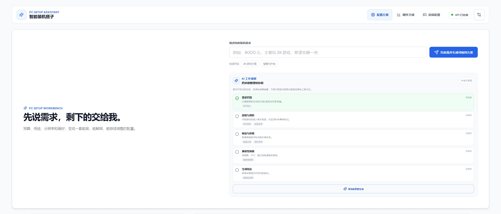

# 智能装机搭子

<p align="center">
  <strong>把“我想装一台电脑”变成一张清晰、可核对的方案表。</strong>
</p>

<p align="center">
  <a href="https://github.com/TreasureGooldove/PC_Setup_Assistant/actions/workflows/ci.yml"></a>
  <a href="https://github.com/TreasureGooldove/PC_Setup_Assistant/stargazers"></a>
  <a href="https://github.com/TreasureGooldove/PC_Setup_Assistant/network/members"></a>
  <a href="https://github.com/TreasureGooldove/PC_Setup_Assistant/blob/main/LICENSE"></a>
  
  
</p>

<p align="center">
  <a href="https://github.com/TreasureGooldove/PC_Setup_Assistant"></a>
</p>



智能装机搭子是一款本地优先的装机方案助手：填写预算、用途和偏好，或直接用自然语言描述需求，系统就会生成多套可解释配置，展示兼容性、价格参考、功耗和导出清单。

如果这个项目对你有帮助，欢迎点一个 **Star**，也欢迎通过 Issue 分享硬件数据、使用建议或改进想法。

当前版本是可运行的 MVP，以可复现的本地参考数据为稳定底座；API 与 Worker 联网时会在后台补充固定白名单公开产品目录，离线或更新失败仍可完整使用。

## 快速开始

### Windows 一键启动

在仓库根目录双击 `install.bat` 完成依赖安装，再双击 `start.bat`。启动脚本会分别打开 API、Worker 和 Vite，并打开 `http://localhost:5173/`；关闭它打开的三个终端窗口即可停止服务。

如果系统提示找不到 `uv` 或 `pnpm`，请先安装对应工具，再重新运行脚本。脚本不会创建或读取项目外的密钥文件。

### Linux 一键安装与启动

```sh
chmod +x install.sh start.sh
./install.sh
./start.sh
```

`start.sh` 会在依赖目录不存在时自动调用安装脚本，按 `Ctrl+C` 会同时停止 API、Worker 和前端开发服务器；如果系统安装了 `xdg-open`，还会自动打开本地预览页。

### 后端

```powershell
cd apps/api
uv sync
uv run alembic upgrade head
uv run uvicorn app.main:app --reload --port 8000
```

另开终端启动任务 Worker：

```powershell
cd apps/api
uv run python -m app.worker
```

### 前端

```powershell
pnpm install
pnpm --dir apps/web dev
```

前端默认访问 `http://localhost:5173`，API 默认访问 `http://localhost:8000`。

启动后打开前端页面，填写预算和用途，选择 CPU/GPU 品牌与散热方式，在顶部输入框点击“告诉我并生成可核对方案”（或按 Enter）。提交一次就会自动整理需求、生成三套方案并定位到方案工作台；API 与 Worker 同时运行时，可以看到实时任务进度并导出 Excel，只启动前端也可以使用内置演示数据。修改参数后可点击“重新生成并核对”。

## 你会拿到什么

- 需求对话：支持预算、用途、分辨率、品牌、散热、噪声、外观和升级需求。
- 三档方案：省心省预算、均衡耐用、高性能释放。
- 装机检查：CPU 插槽、内存代际/容量、主板与机箱尺寸、显卡长度、散热器扣具与空间、冷排尺寸、硬盘接口、显卡供电和电源余量；缺失字段会显示“待确认”。
- 方案操作：点击配置项型号或“换一件”进入选配器；每个品类内置至少 12 个稳定候选，并可按型号、具体厂商、系列和价格区间筛选，重新计算总价、功耗和兼容性。
- 厂商候选：显卡等品类直接列出华硕、技嘉、微星、七彩虹、蓝宝石等具体产品型号、关键参数、参考价、来源与更新时间；后台目录更新完成后与本地候选合并，不会覆盖稳定回退数据。
- 商品详情：查看完整结构化参数、排行、优缺点、数据状态和信源，并同屏比较京东与拼多多报价。
- 清单导出：生成包含方案概览、配件明细和兼容性检查的 `.xlsx` 文件。
- 硬件天梯：CPU/显卡目录分别提供 15 个以上候选，用型号、品牌和价格筛选 S/A/B/C 档，点击型号可进入手动选配；结构参考 ZOL 天梯，分数为本地归一化结果。
- 游戏配置：按游戏名称、常用别名或 Steam App ID 查询最低配置与推荐配置；默认包含 War Thunder 等本地快照，Steam Store 适配器可选开启。
- 主题切换：默认企业简洁风，可在右上角设置中切换为玻璃拟态或新拟物派。
- 机身大小：可选择自动匹配、ATX、mATX 或 Mini-ITX 小钢炮，方案会同步选择主板与机箱规格。
- Agent 工作摘要：输入区展示需求识别、资料整理、候选整理、规则复核和结构化结论；只显示可核对摘要，不显示模型隐藏推理或原始工具日志。
- 可选社区检索：通过 ModelScope 的 open-webSearch MCP 补充百度贴吧公开摘要；默认关闭，失败时保留人工搜索入口，不阻塞方案生成。

## 从需求到清单

```text
提交需求 → 自动结构化解析 → 生成候选方案 → 硬件规则校验 → 进入可核对工作台 → 查看/替换 → 导出清单
```

模型只参与需求理解和说明；预算计算、配件选择、兼容性判断、任务状态和 Excel 字段均由后端确定性代码校验。

生成方案后，页面会展示“AI 辅助建议”：它把需求、游戏配置、当前配件、价格状态和兼容性检查整理成可审计的结论、选择理由、来源和待确认项。页面不展示或保存模型隐藏思考过程；未配置 Qwen、网络不可用或结构化结果校验失败时，会自动使用本地 Mock 建议。

## 配置

复制 `apps/api/.env.example` 为本地 `.env`。Fixture 模式不需要外部密钥；如需启用模型，只在本地配置新的服务商密钥。

```env
LLM_API_KEY=
LLM_API_BASE=https://example.invalid/compatible-mode/v1
LLM_MODEL=qwen3.8-max
LLM_TIMEOUT_SECONDS=20
LLM_MAX_OUTPUT_TOKENS=1400
STEAM_API_ENABLED=false
STEAM_API_BASE=https://store.steampowered.com/api
MODELSCOPE_MCP_ENABLED=false
MODELSCOPE_MCP_COMMAND=npx
MODELSCOPE_MCP_ARGS_JSON=["-y","open-websearch@2.1.9"]
MODELSCOPE_MCP_ENV_JSON={"MODE":"stdio","ALLOWED_SEARCH_ENGINES":"baidu,bing"}
MODELSCOPE_MCP_TIMEOUT_SECONDS=18
COMMUNITY_SEARCH_MAX_RESULTS=5
CATALOG_PUBLIC_SYNC_ENABLED=true
CATALOG_SYNC_TTL_HOURS=12
CATALOG_SYNC_MAX_ITEMS=40
JD_PUBLIC_FETCH_ENABLED=false
JD_PRODUCT_URLS_JSON={}
REALTIME_PRICES_REQUIRED=false
TAOBAO_MCP_ENABLED=false
TAOBAO_MCP_COMMAND=python
TAOBAO_MCP_SERVER_PATH=
TAOBAO_MCP_WORKING_DIRECTORY=
TAOBAO_MCP_FETCH_TOOL=taobao_fetch_product
TAOBAO_PRODUCT_URLS_JSON={}
```

`CATALOG_PUBLIC_SYNC_ENABLED` 控制固定白名单公开产品目录的后台同步。同步由持久化 Worker 执行，结果写入 SQLite 缓存；默认每 12 小时判断一次新鲜度，每个品类最多读取 40 个公开候选。升级代码后应同时重启 API 和 Worker，避免旧 Worker 继续处理新任务类型。

`JD_PUBLIC_FETCH_ENABLED` 只控制显式配置的公开京东商品页参数解析。`JD_PRODUCT_URLS_JSON` 使用“内部配件 ID → `https://item.jd.com/<数字>.html`”映射；解析器只读取公开 HTML，不使用登录态、不执行页面脚本、不绕过验证码或反爬。读取失败会回退到结构化目录，并在商品详情中标明状态。

`REALTIME_PRICES_REQUIRED=true` 时，API 不会把 Fixture 金额返回为报价；只有取得并校验过的授权/配置数据才会进入报价列表。淘宝 MCP 接入说明见 [`integrations/taobao-mcp/README.md`](integrations/taobao-mcp/README.md)。它需要“内部配件 ID → 淘宝/天猫商品 ID 或链接”映射，并会复用外部服务的浏览器会话；首次使用可能需要人工扫码。未配置、未登录或未解析到明确金额时会显示“未获取实时价”。

ModelScope 公开检索 MCP 接入说明见 [`integrations/modelscope-mcp/README.md`](integrations/modelscope-mcp/README.md)。它只读取公开搜索摘要，固定调用 `search`，社区帖子标记为低可信度，不能改变价格、配件身份或兼容性结论。网络不可用、第三方风控或未安装 Node.js 时，API 会返回明确的 `disabled`/`unavailable` 状态并继续使用本地方案。

建议接口为 `POST /api/plans/{plan_id}/recommendations` 和 `GET /api/recommendations/{id}`，任务进度仍通过 `/api/jobs/{id}` 与 `/api/jobs/{id}/events` 获取。后端只向可选模型提供固定的只读上下文工具：需求、游戏配置、当前方案、兼容性和报价依据；不会把数据库、密钥或任意 MCP 执行能力交给模型。

不要把 `.env` 或任何密钥提交到 Git。

## 测试

```powershell
cd apps/api
uv run pytest
uv run ruff check .

cd ../..
pnpm --dir apps/web lint
pnpm --dir apps/web typecheck
pnpm --dir apps/web test
pnpm --dir apps/web build
```

后端还可以运行类型检查和迁移检查：

```powershell
cd apps/api
uv run mypy app
uv run alembic upgrade head
```

## 目录

- `apps/api`：FastAPI、领域服务、SQLite 队列、Provider 和导出。
- `apps/web`：React 对话界面、方案面板和任务实时状态。
- `agnet`：脱敏的 Spec、决策记录、角色定义和验证证据。
- `design-system`：UI 设计系统源文件。
- `plan.md`：本次实现计划。

## 数据来源边界

Fixture 始终作为可复现的稳定回退。CPU/显卡天梯字段结构参考 [ZOL CPU 天梯](https://cpu.zol.com.cn/soc/) 与 [ZOL 显卡天梯](https://vga.zol.com.cn/soc/)，DIY 参数入口参考 [ZOL DIY](https://diy.zol.com.cn/)；应用内排名和分数是本地归一化值。八类配件可由 Worker 读取固定的 [ZOL 产品列表](https://detail.zol.com.cn/) 白名单页面，解析公开型号、厂商、摘要、图片和参考价，写入有时效的本地缓存后再与 Fixture 合并。候选详情默认提供京东与拼多多搜索入口；没有可核验的平台报价时显示“待联网”，不从目录参考价推导金额、店铺或采集时间。ZOL 参数页里的电商金额显示为“公开参考价”，也不等同于实时成交价。京东联盟、拼多多多多客、淘宝联盟和视频证据能力通过 Provider 接口接入，报价标准化保留平台、SKU、券后预估价、店铺、地区和采集时间。

可选公开页解析只允许 HTTPS 的固定白名单：京东 `item.jd.com/<数字>.html` 商品页与 ZOL `detail.zol.com.cn/<数字>/<数字>/param.shtml` 参数页；设置响应大小、类型、超时和重定向限制。不实现验证码绕过、浏览器指纹伪装、账号滥用或大规模隐蔽抓取。

## 开发约定

- Python API 与 Worker 位于 `apps/api`，React 工作台位于 `apps/web`。
- 任务使用 SQLite 持久化队列，支持幂等、租约、取消、重试、死信和 SSE 进度事件。
- Agent/Spec 的可审计资料统一放在 `agnet/`；根目录 `plan.md` 只保留项目计划摘要。
- 本地密钥只放在未跟踪的 `.env` 中。聊天中曾公开的密钥不应继续使用，应先在服务商控制台撤销并重新生成。

## 当前边界

已有：本地演示、需求对话、三套方案、兼容性规则、持久化 Worker、SSE、生成进度条、导出、扩展硬件天梯、八品类候选扩容、固定白名单目录同步、厂商/系列/价格筛选、型号直接换件、独立商品详情、京东/拼多多报价状态、受控京东公开参数解析、游戏最低/推荐配置查询、结构化 Agent 工作摘要和 CI。

预留：京东联盟/拼多多多多客真实报价、更多京东商品 ID 映射、Steam Store 更多字段标准化、用户提供的视频字幕或摘要证据、更多硬件规格和多用户存储；淘宝 MCP 与 ModelScope open-webSearch 均提供可选 sidecar 连接器，需用户自行安装并配置，社区检索仅作为低权重证据。

暂不提供：自动购买、验证码绕过、账号登录代采、大规模不稳定网页抓取、隐蔽采集第三方内容。
